# DriveLab Telem for BeamNG.drive

  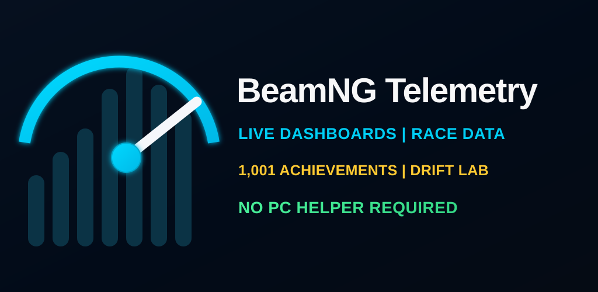

  <strong>Turn an Android phone or tablet into a dedicated BeamNG.drive dashboard, TrackLab course tool, Auto Co-Driver, and RaceLink multiplayer race companion.</strong>

  
  
  

  <a href="https://drivelabregistration.org"><strong>GET DRIVELAB THROUGH GOOGLE PLAY</strong></a>
  &nbsp; | &nbsp;
  <a href="INSTALL.md"><strong>SETUP GUIDE</strong></a>
  &nbsp; | &nbsp;
  <a href="FAQ.md"><strong>FAQ</strong></a>
  &nbsp; | &nbsp;
  <a href="PRIVACY.md"><strong>PRIVACY</strong></a>

---

## Official distribution notice

**DriveLab Telem is no longer distributed as a downloadable APK through GitHub.** This repository remains online for product information, setup instructions, screenshots, privacy information, and support documentation.

- During closed testing, use the official website to join the Google Play test and obtain the Play Store installation link.
- After public launch, install and update DriveLab only through the Google Play Store.
- Do not download or redistribute archived DriveLab APK files from mirrors, old posts, or third-party websites.

### Legacy APK users

Older GitHub/sideloaded builds were signed differently from the Google Play release and **cannot be upgraded in place** to the Play Store version. Android requires the legacy app to be uninstalled before the official Google Play build can be installed.

Uninstalling removes locally stored app data. Export or record anything important before migrating where the installed version provides that option. After migration, all future updates should come from Google Play.

## Current release status

Current closed-test build: **DriveLab Telem 2.4.4 (revision 42)**.

DriveLab is currently completing Google Play closed testing before production access. The official website provides the current testing or release instructions.

## Put your telemetry where it belongs

Stop covering the game with extra HUD windows. Mount an Android phone beside your wheel or on your desk and use it as a clean, dedicated second screen for live driving data.

DriveLab Telem connects directly to BeamNG.drive over your local network using the game's built-in **OutGauge** and **MotionSim** UDP outputs.

**No PC helper program and no BeamNG mod are required.** Normal dashboard telemetry stays between the BeamNG PC and Android device. RaceLink network data is sent only while the driver uses RaceLink features.

## Major features

- **Live Dashboard** — real-time speed, RPM, gear, temperatures, fuel, forces, and driving data
- **Digital Cockpit** — focused instrument cluster for normal driving and racing
- **TrackLab** — record, save, time, map, and compare circuits, roads, hill climbs, and point-to-point stages
- **Auto Co-Driver** — locally generated spoken corners, braking, crests, dips, jumps, timing, numbered callouts, and editable pace notes
- **RaceLink** — friends, rooms, invites, chat, ready checks, countdowns, live standings, and results
- **Drift Lab** — drift angle, scoring, performance, and session results
- **Drag and Brake Testing** — acceleration runs and braking performance
- **Vehicle Dynamics** — motion and handling data beyond basic gauges
- **Achievement Vault** — 1,001 distinct driving challenges with secret and high-difficulty goals
- **Driver Progression** — persistent local driving profile
- **Automatic drive tracking** — completed-drive summaries and comparisons
- **Free download** — basic live telemetry and setup access
- **Full Edition** — optional one-time Google Play purchase unlocking the advanced DriveLab feature set after production launch
- **Google Play updates** — official signing, installation, purchase handling, and automatic update delivery through Google Play

## RaceLink

- Add friends using permanent `DL-XXXXXX` friend codes
- Send and accept friend requests inside the app
- Create private six-character RaceLink rooms before selecting a course
- Join by room code or direct friend invitation
- Built-in lobby chat
- Host-selected TrackLab course and race configuration
- Circuit, point-to-point, and timed best-lap modes
- Ready checks and a synchronized eight-second countdown
- Live driver positions, connection state, progress, sectors, standings, and final results
- Up to eight Full Edition drivers per room

RaceLink coordinates phones, course data, timing, standings, and results. It does **not** place vehicles into another player's BeamNG world. Drivers should use the same BeamNG map and the same shared TrackLab course for meaningful comparison.

## Achievement Vault and Auto Co-Driver

- **1,001 distinct challenges** instead of repetitive next-speed tiers
- Secret, legendary, insane, multi-condition, endurance, control, impact, off-road, drift, launch, braking, and long-term progression goals
- More reliable spoken calls throughout a TrackLab run
- Adaptive Early, Normal, and Late timing
- Automatic **Jump**, **Big Jump**, and **Quick Dip** pace notes
- Numbered callout markers on the TrackLab map
- Matching map legend and pace-note review list

## See DriveLab Telem in action

<table>
  <tr>
    <td width="50%" align="center"><strong>Live Dashboard</strong> 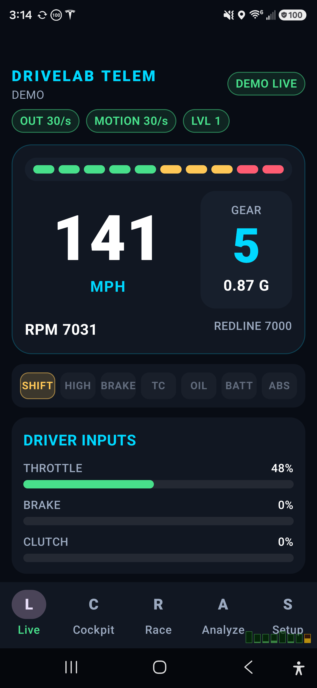</td>
    <td width="50%" align="center"><strong>Digital Cockpit</strong> 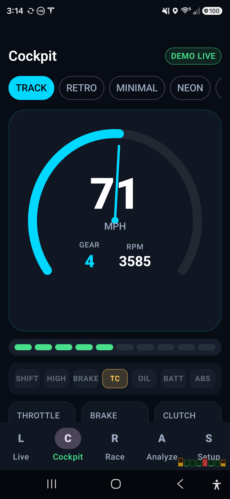</td>
  </tr>
  <tr>
    <td width="50%" align="center"><strong>Drift Lab</strong> 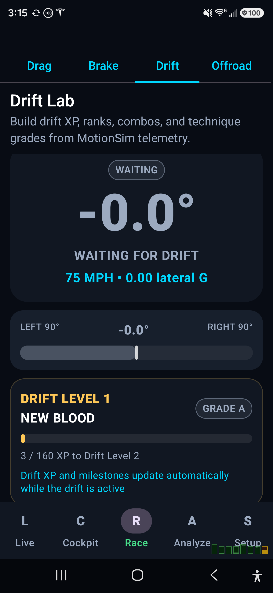</td>
    <td width="50%" align="center"><strong>Achievements</strong> 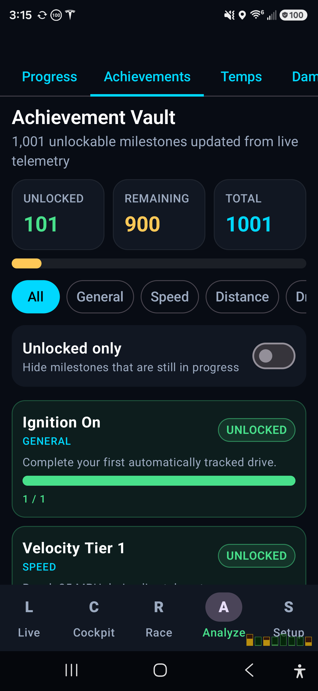</td>
  </tr>
  <tr>
    <td width="50%" align="center"><strong>Driver Progression</strong> 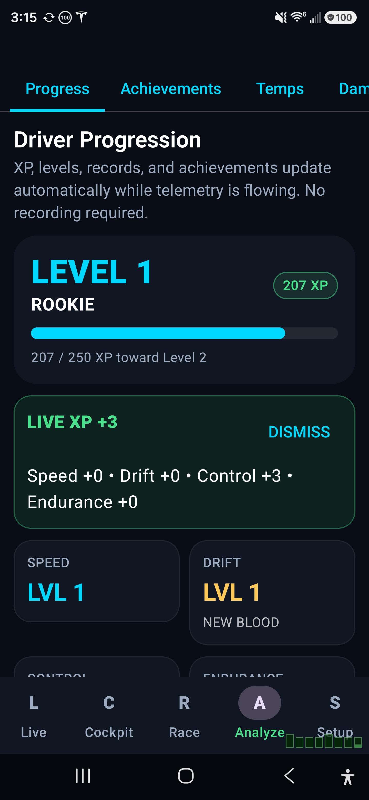</td>
    <td width="50%" align="center"><strong>Drag and Brake Testing</strong> 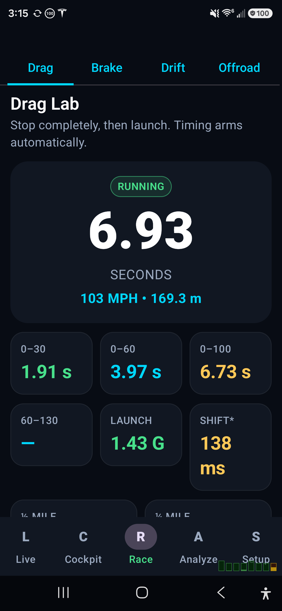</td>
  </tr>
  <tr>
    <td width="50%" align="center"><strong>Vehicle Dynamics</strong> 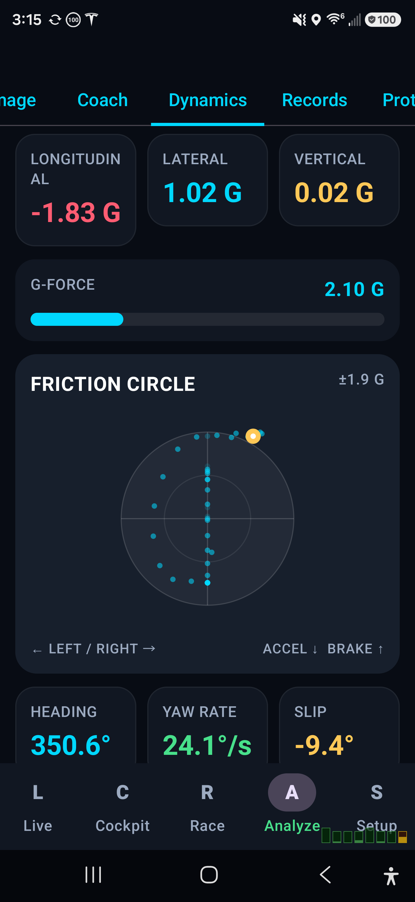</td>
    <td width="50%" align="center"><strong>Guided Setup</strong> 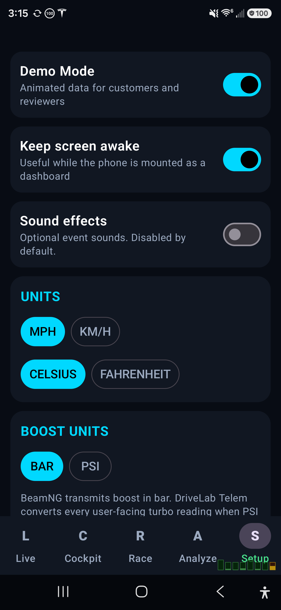</td>
  </tr>
  <tr>
    <td width="50%" align="center"><strong>RaceLink Friend Code</strong> 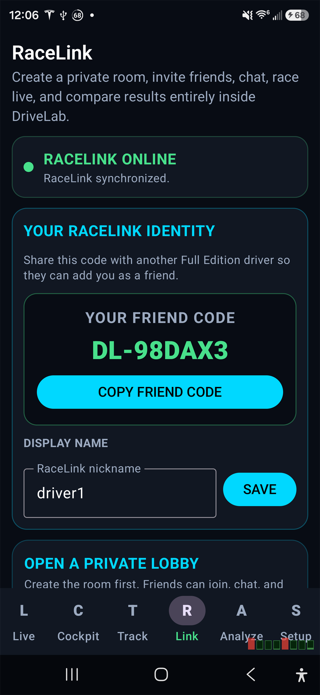</td>
    <td width="50%" align="center"><strong>Create or Join</strong> 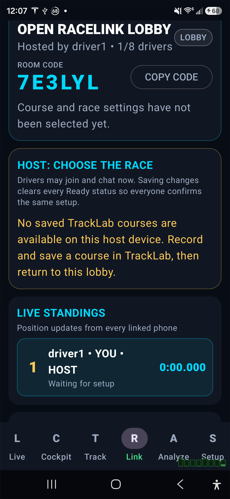</td>
  </tr>
  <tr>
    <td width="50%" align="center"><strong>Lobby Chat</strong> 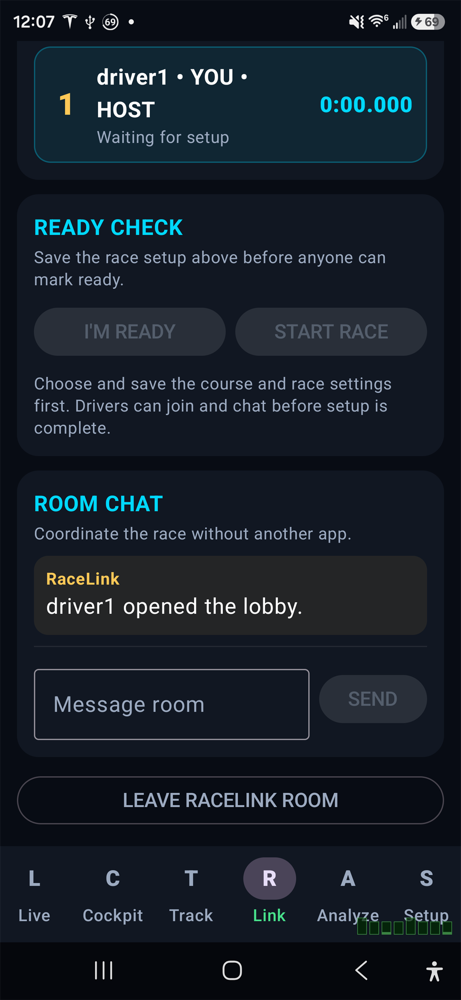</td>
    <td width="50%" align="center"><strong>Drivers Ready</strong> 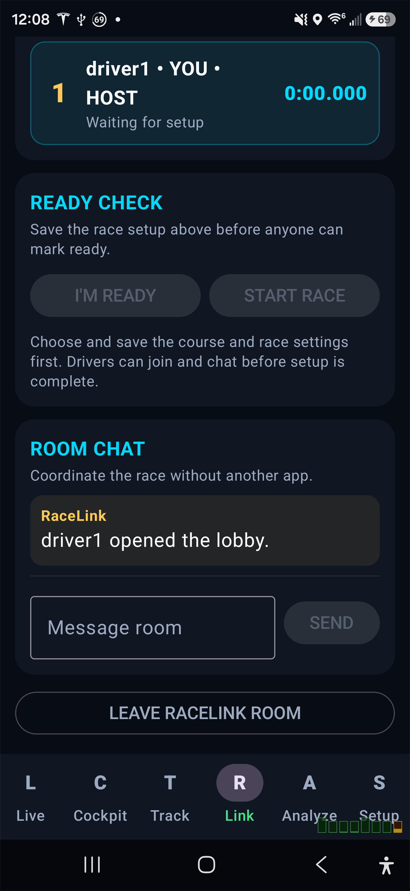</td>
  </tr>
</table>

## Quick setup

1. Obtain DriveLab from the official Google Play testing or production listing through the [DriveLab website](https://drivelabregistration.org).
2. Connect the Android device and BeamNG PC to the same network.
3. In BeamNG.drive, open `Options > Other > Protocols`.
4. Send **OutGauge** to the Android device IP on UDP port `4444`.
5. Send **MotionSim** to the Android device IP on UDP port `4445`.
6. Open DriveLab Telem and confirm both telemetry indicators are active.

Read the complete [installation and telemetry setup guide](INSTALL.md).

## Requirements

- Android 8.0 or newer
- BeamNG.drive on a Windows PC
- Phone and PC on the same local network for game telemetry
- BeamNG OutGauge and MotionSim enabled
- Internet access for Google Play installation, entitlement refresh, updates, and RaceLink
- Full Edition for premium features after production launch

## Privacy and ownership

Normal BeamNG telemetry is sent locally from the PC to the Android device. Auto Co-Driver route analysis and pace-note generation remain local to the Android device. When RaceLink is used, the app sends the minimum room, identity, course, timing, position/progress, chat, readiness, and result data needed to operate that online feature. See the [privacy policy](PRIVACY.md) for details.

DriveLab Telem is commercial software. This repository publishes customer documentation and product media. It does not publish proprietary Android source code, signing keys, license-server private keys, customer databases, or server credentials.

## Support

Visit the **[official DriveLab Telem website](https://drivelabregistration.org)**, then check the [setup guide](INSTALL.md) and [FAQ](FAQ.md). For support, email **auroramediagroup1@gmail.com** with the app version, Android device, BeamNG setup, connection status, and a screenshot that does not expose a license, purchase token, admin token, or other sensitive information.

---

**BeamNG.drive is a trademark of BeamNG GmbH. DriveLab Telem is an independent third-party companion application and is not affiliated with or endorsed by BeamNG GmbH.**